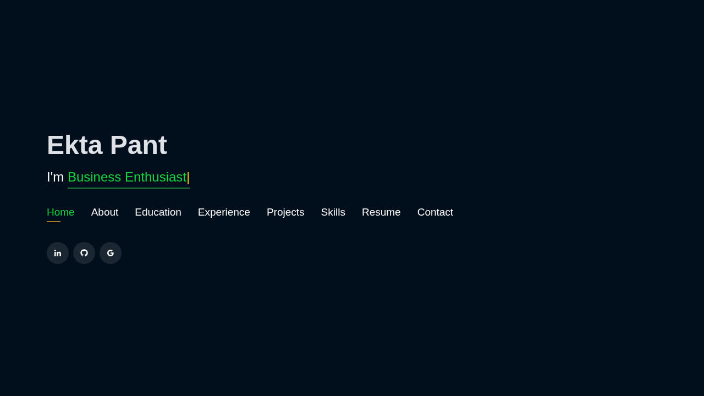
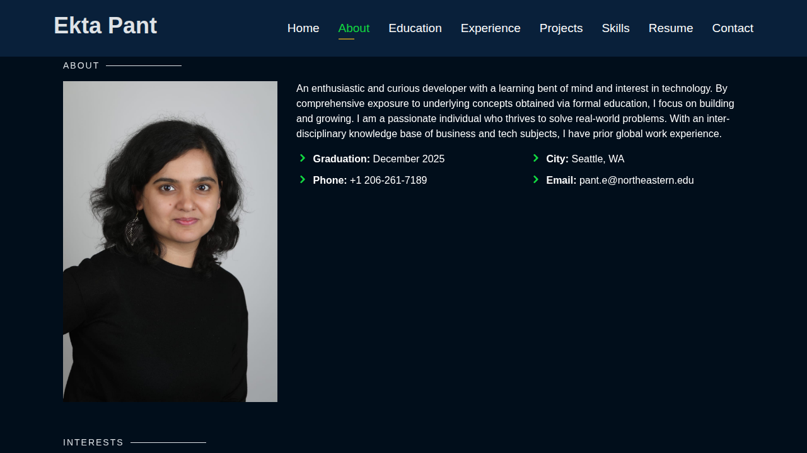
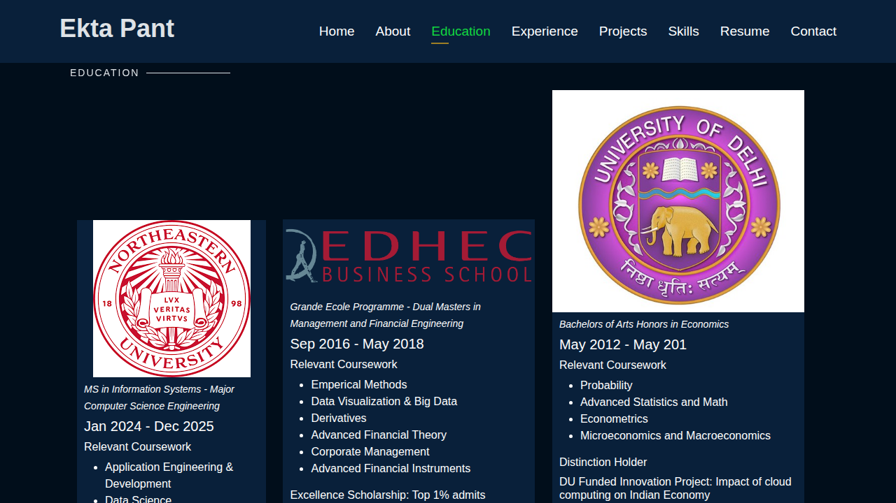
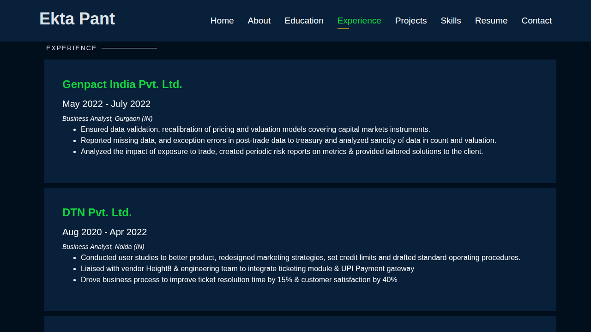
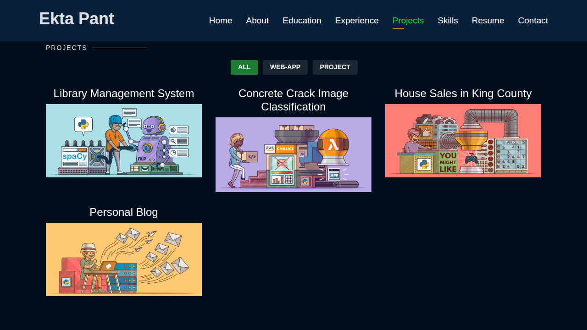
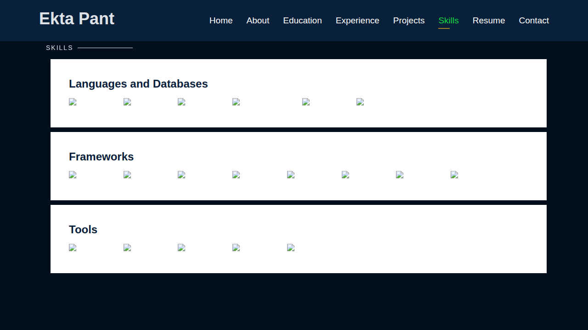
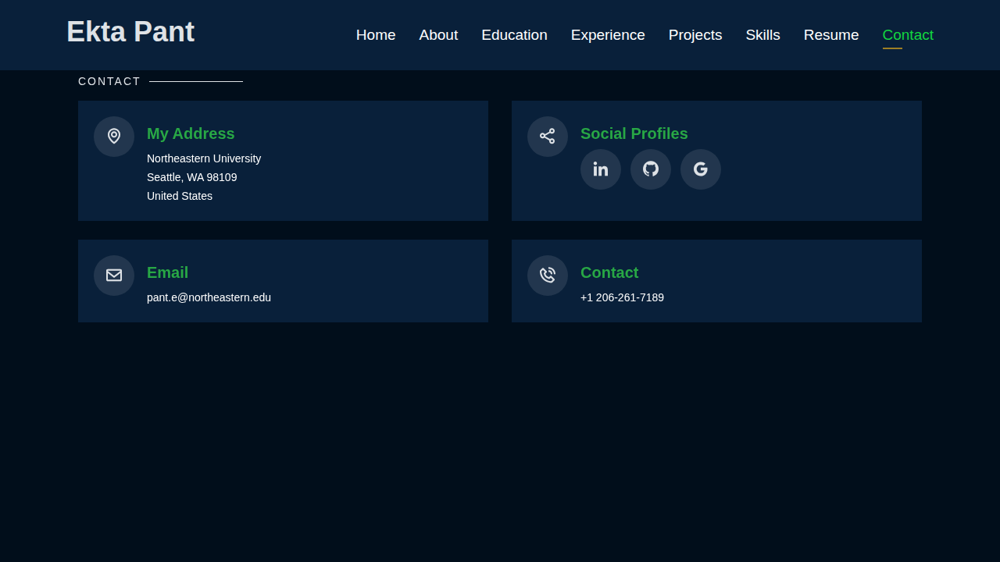

# Ekta Pant - Portfolio Website

> **Live Site:** [https://pante008.github.io/Ekkta.github.io/](https://pante008.github.io/Ekkta.github.io/)

A professional portfolio website showcasing the academic journey, technical expertise, and project work of Ekta Pant - a graduate student pursuing MS in Information Systems with a Computer Science Engineering focus at Northeastern University.

## 🎯 Visual Preview

### Landing Page

*Interactive homepage featuring dynamic typing animation showcasing roles: Software Developer, Business Analyst, and Data Enthusiast*

### About Section

*Comprehensive overview highlighting educational background, interests in technology, business analysis, and software development*

### Education

*Three degrees across continents - MS at Northeastern University (Seattle), Masters at EDHEC Business School (France), BA at University of Delhi (India)*

### Experience

*Professional work history showcasing roles at Genpact, DTN, and ClearStream with detailed accomplishments*

### Projects Showcase

*Featured projects including Library Management System, Concrete Crack Image Classification, House Sales Analysis, and Personal Blog*

### Skills

*Technology stack visualization including programming languages, databases, frameworks, and development tools*

### Contact

*Multiple channels to connect professionally with location, social profiles, and contact information*

---

## 🌟 What Makes This Portfolio Special

This website brings together an interdisciplinary background spanning software engineering, financial analysis, and business management. The portfolio demonstrates:

- **Technical Proficiency**: Implementations in Python, Java, Machine Learning frameworks
- **Global Experience**: Educational credentials from institutions in USA, France, and India
- **Real-World Applications**: Projects addressing practical challenges in various domains
- **Modern Web Design**: Clean, responsive interface with smooth animations and intuitive navigation

## 📑 Portfolio Navigation

The website is organized into these key areas:

| Section | Content Description |
|---------|-------------------|
| **Home** | Dynamic introduction with animated role titles |
| **About** | Professional summary and contact details |
| **Interests** | Eight core focus areas: Business Analysis, ML, Financial Analysis, Project Management, Software Dev, Data Viz, Algorithms, Product Development |
| **Education** | Three degrees across continents - MS at NEU (Seattle), Masters at EBS (France), BA at DU (India) |
| **Experience** | Professional work history and achievements |
| **Projects** | Portfolio of academic and personal projects with detailed breakdowns |
| **Skills** | Technology stack visualization including languages, frameworks, and development tools |
| **Resume** | Direct access to downloadable CV |
| **Contact** | Multiple channels to connect professionally |

## 🛠️ Technology Implementation

**Frontend Stack:**
- HTML5 semantic markup
- CSS3 with Bootstrap framework for responsive design
- JavaScript with Typed.js library for text animations
- Owl Carousel for smooth content transitions
- Venobox for lightbox gallery functionality
- AOS (Animate On Scroll) library

**Design Assets:**
- Custom icon integration via Boxicons and Icofont
- RemixIcon for additional visual elements
- Google Fonts (Open Sans, Raleway, Poppins)

**Analytics & Optimization:**
- Google Analytics integration
- Google Tag Manager implementation

## 🚀 Local Development Setup

To run this portfolio locally on your machine:

```bash
# Clone this repository
git clone https://github.com/pante008/Ekkta.github.io.git

# Navigate into directory
cd Ekkta.github.io

# Open in your preferred browser
# Option 1: Direct file opening
open index.html

# Option 2: Using Python's built-in server
python -m http.server 8000
# Then visit: http://localhost:8000

# Option 3: Using Node.js http-server
npx http-server
```

## 📂 Repository Organization

```
Ekkta.github.io/
├── index.html              # Main portfolio page
├── favicon.png             # Browser tab icon
├── assets/                 # Stylesheets, scripts, images
│   ├── css/               # Custom styling
│   ├── img/               # Profile and project images
│   ├── js/                # JavaScript functionality
│   └── vendor/            # Third-party libraries
├── projects/              # Individual project detail pages
│   ├── blog.html
│   ├── lms.html
│   ├── imageclassification.html
│   └── housesales.html
├── website_images/        # README preview screenshots
└── LICENSE                # MIT License
```

## 💼 Professional Connections

- **LinkedIn:** [linkedin.com/in/ekta-pant](https://www.linkedin.com/in/ekta-pant)
- **GitHub:** [github.com/pante008](https://www.github.com/pante008)
- **Email:** pant.e@northeastern.edu
- **Location:** Seattle, WA

## 📜 License

This project is licensed under the MIT License - refer to the LICENSE file for complete terms.

---

*Portfolio template foundation from BootstrapMade, extensively customized and enhanced for personal branding*
